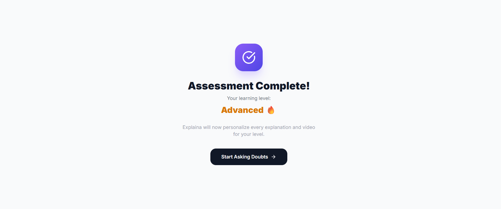
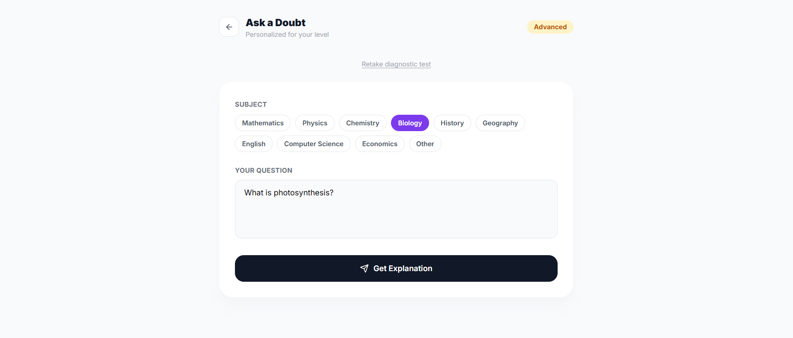
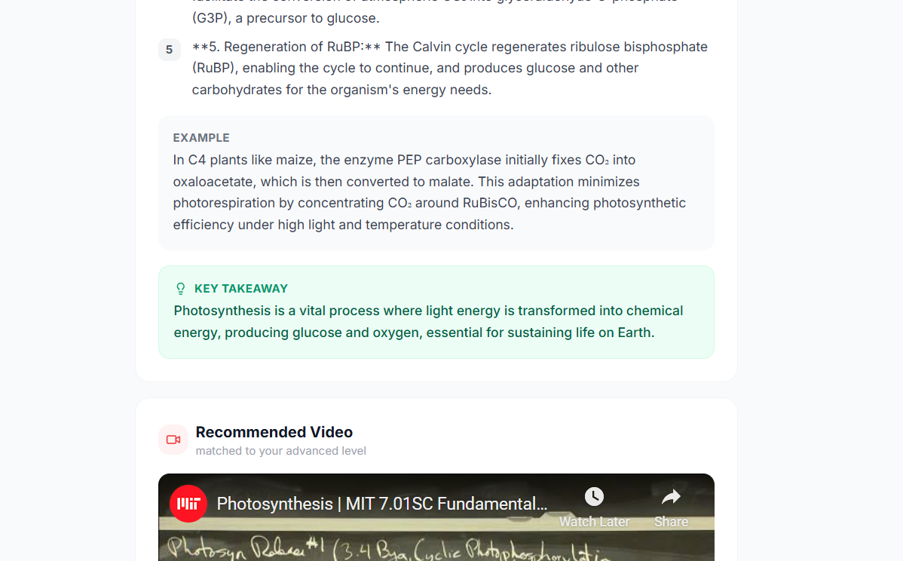

# Explaina — Adaptive Learning Platform

Explaina is an adaptive learning system that personalizes explanations and video recommendations based on a student's comprehension level.

---

## 🚀 The Problem

Most educational content is standardized.  
Students with different understanding levels receive the same explanation, leading to confusion or shallow learning.

---

## 💡 The Solution

Explaina adapts learning dynamically by:

- Assessing user comprehension through a diagnostic test
- Classifying understanding level
- Generating level-specific explanations
- Recommending curated video content
- Suggesting related follow-up questions

---

## 🔍 How It Works

1. User takes a diagnostic test  
2. System determines comprehension level  
3. User submits a doubt/topic  
4. Explanation is generated based on level  
5. Video recommendations are provided  
6. Related adaptive questions are suggested  

---

## 🖼 Product Screenshots

### Homepage

### Diagnostic Test

### Assessment Result

### Doubt Submission

### Generated Explanation

### Video Recommendations

### Related Questions

---

## 🛠 System Design Focus

- Adaptive logic-based content structuring  
- AI-assisted explanation generation  
- Context-aware recommendation flow  
- Structured UI/UX for learning clarity  

---

## 🎯 Vision

To build a learning system that adapts to the student — not the other way around.
